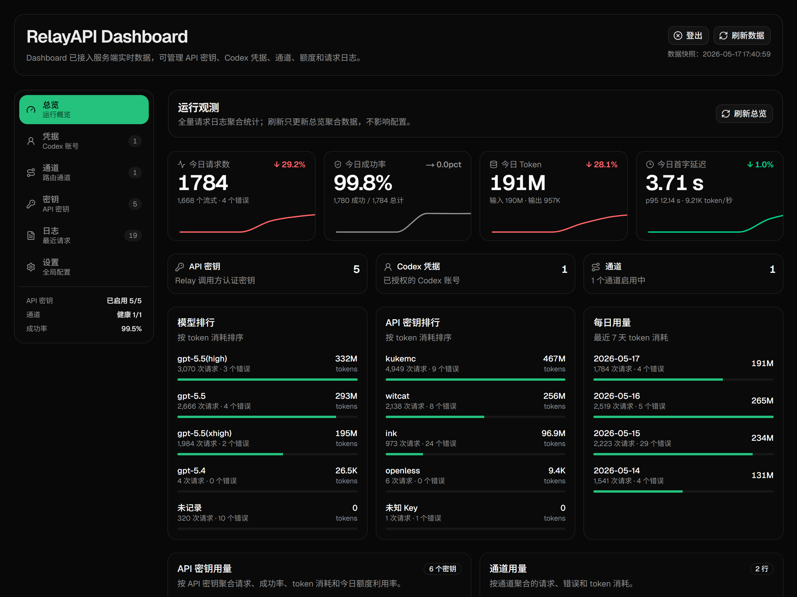
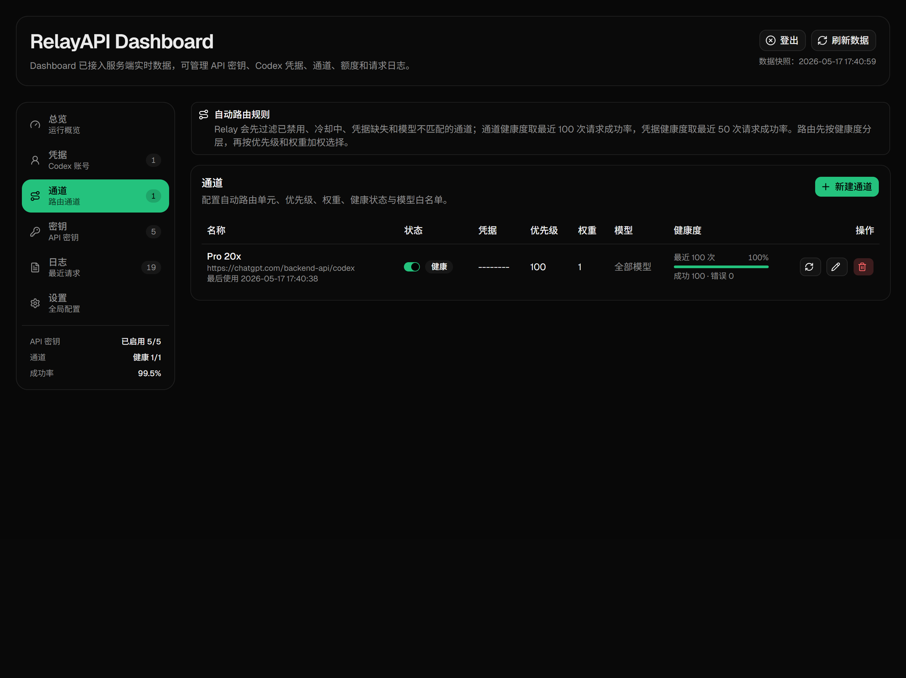
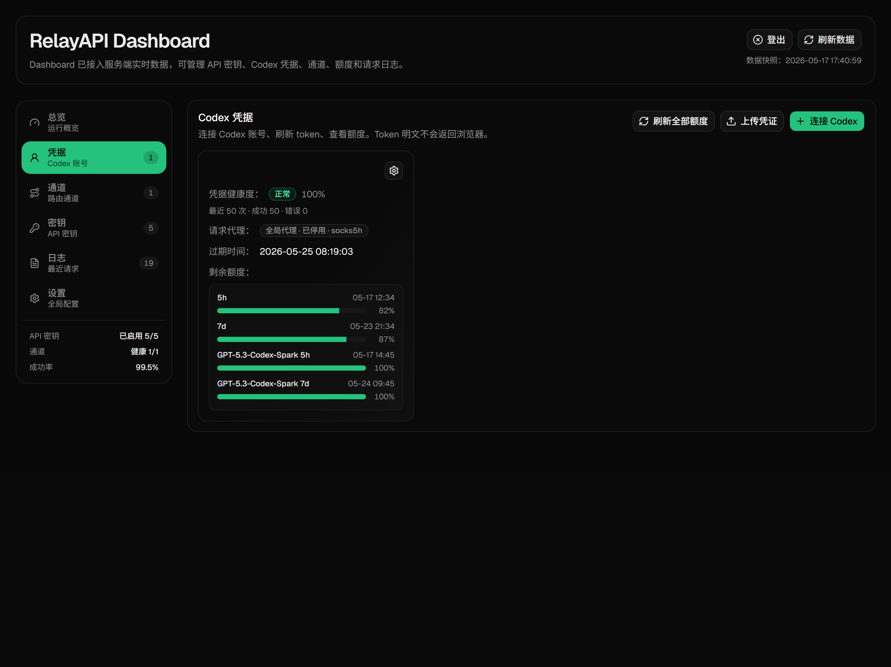

# RelayAPI

RelayAPI - 一站式管理你的 Codex OAuth

[快速开始](#快速开始) | [Web 访问密钥](#web-访问密钥) | [管理后台](#web-管理后台) | [LinuxDO](https://linux.do/)

---





---

## 项目简介

RelayAPI 是一个基于 Next.js App Router 的分层中继服务，用于管理 Codex / OpenAI-compatible 请求流量、API Key、Codex 凭据、渠道路由、请求日志与用量状态。

项目特性：

- 支持 OpenAI-compatible  接口。
- 支持 Codex OAuth 凭据接入与配额刷新。
- 支持 API Key 管理与 Web 管理后台。
- 支持自动渠道路由，无需前端选择“当前凭据”。
- 使用双 SQLite 数据库存储配置、运行状态、日志、审计与用量数据。
- 使用 `better-sqlite3` 作为 SQLite 后端。
- 支持 imge

## 环境要求

- Node.js `>=24.0.0`
- pnpm `10.33.0`

本地运行：

```bash
pnpm install
pnpm dev
```

## 快速开始

```yaml
services:
  relay-api:
    image: sipcink/relay-api:latest
    container_name: relay-api
    restart: unless-stopped
    ports:
      - "3000:3000"
    environment:
      NODE_ENV: production
      PORT: "3000"
      HOSTNAME: 0.0.0.0
      DATA_DIR: /app/data
    volumes:
      - relay-api-data:/app/data

volumes:
  relay-api-data:
    name: relay-api-data
```

## Web 访问密钥

首次启动服务时，RelayAPI 会自动生成一个 `relay_web_...` Web 访问密钥，并在首次启动日志中输出。使用 Docker Compose 部署时，可以通过以下命令查看：

```bash
docker logs relay-api
```

访问 Web 管理页面时必须输入该密钥；验证成功后，系统会写入 HTTP-only 会话 Cookie。

密钥明文只会在首次生成时显示一次，哈希会保存到：

```text
data/.relay-web-access-key
```

如果密钥丢失，可以停止服务，删除该文件后重新启动，系统会生成新的 Web 访问密钥。

也可以通过环境变量指定固定 Web 访问密钥：

```env
RELAY_WEB_ACCESS_KEY=relay_web_...
# 或
WEB_ACCESS_KEY=relay_web_...
```

设置后不会自动生成密钥文件。

## Codex User-Agent

发往 Codex 上游接口和额度刷新接口的 `User-Agent` 可在 Web 管理台的“全局设置”中配置，也可在单个 Codex 凭据的设置弹窗中单独覆盖。

生效优先级：凭据覆盖值 → 管理台全局设置 → `CODEX_USER_AGENT` 环境变量 → 内置默认值。

```env
CODEX_USER_AGENT="codex_cli_rs/0.118.0 (Mac OS 26.3.1; arm64) iTerm.app/3.6.9"
```

清除管理台全局设置后，会回退到环境变量或内置默认值；清除凭据覆盖后，会使用当前全局 User-Agent。

## 全局时区

RelayAPI 将时间点以 UTC ISO 8601 格式存储和传输，并在界面中按管理台“全局设置”选择的 IANA 时区展示。默认时区为 `Asia/Shanghai`。

全局时区同时决定“今日”、每日额度、趋势图、热力图和历史日聚合的日期边界。管理员修改时区后，系统会在后台重新构建历史每日统计；重建成功前继续使用原时区，失败不会破坏原有统计。设置界面支持运行环境提供的完整 IANA 时区列表，例如 `Asia/Shanghai`、`Europe/London` 和 `America/New_York`。

SQLite 历史数据中不带时区的 `YYYY-MM-DD HH:mm:ss` 值按 UTC 解释。容器的 `TZ` 和访问者浏览器时区不会改变应用时间语义。

## Codex Model Header Overrides

可通过 `CODEX_MODEL_HEADER_OVERRIDES` 为全部模型或指定模型覆盖 Codex 上游兼容性 Header：

```env
CODEX_MODEL_HEADER_OVERRIDES='{"*":{"x-codex-beta-features":"responses_websockets=2026-07-10"},"gpt-5.3-codex":{"User-Agent":"codex_cli_rs/...","Originator":"codex_cli_rs"}}'
```

生效优先级：现有全局、租户或凭据 Header → `*` 通配配置 → 精确模型配置。只允许覆盖 `User-Agent`、`Originator`、`x-codex-beta-features` 和 `OpenAI-Beta`；JSON 格式错误、非法 Header 或包含控制字符的值会阻止服务启动。

## 租户份额额度

管理员可在“租户与密钥”中为租户设置额度份额，并在“份额与成本”中查看或覆盖每份 5 小时和 7 天额度。Plus 默认折算为 1 份，Pro 默认折算为 20 份。租户的所有 API Key 共同消耗固定窗口额度；份额留空时不启用该策略，原有每日 Token 和每分钟请求限制仍独立生效。

系统按模型输入、输出、缓存读取、缓存写入和推理 Token 的价格计算成本。价格优先级为管理员覆盖、已同步的 LiteLLM 目录、内置快照。目录每天自动同步，也可从管理台手动同步。未知价格的模型不会按零成本放行启用份额额度的租户。

系统每 5 分钟刷新启用的上游 Codex 凭据额度，比较同一凭据在同一重置窗口内的额度百分比变化与本地已定价成本，推算每份容量；重置、百分比下降、变化过小或存在未定价请求的样本会被拒绝。管理员覆盖值优先于自动校准值。

达到 5 小时或 7 天任一限额时，中转在调用上游前返回 HTTP 429、`tenant_quota_exceeded`、`Retry-After`、触发窗口、已用/剩余成本和重置时间。正常文本响应包含 `x-relay-quota-*` 系列响应头。并发请求会先预留额度，完成后按实际成本结算；崩溃遗留预留会在后续请求及小时维护任务中回收。

## 路由与冷却

凭据级冷却时间可通过环境变量配置，单位为毫秒。默认只对 `429` 做 5 分钟冷却，`401` / `403` 不再固定长时间摘除凭据，避免上游或代理短暂波动导致长期无可用通道。

```env
RELAY_CODEX_CREDENTIAL_COOLDOWN_401_MS=0
RELAY_CODEX_CREDENTIAL_COOLDOWN_403_MS=0
RELAY_CODEX_CREDENTIAL_COOLDOWN_429_MS=300000
RELAY_USAGE_HEALTH_CACHE_TTL_MS=5000
```


## Star History

<a href="https://www.star-history.com/?repos=SIPC%2FRelayAPI&type=date&legend=top-left">
 <picture>
   <source media="(prefers-color-scheme: dark)" srcset="https://api.star-history.com/chart?repos=SIPC/RelayAPI&type=date&theme=dark&legend=top-left" />
   <source media="(prefers-color-scheme: light)" srcset="https://api.star-history.com/chart?repos=SIPC/RelayAPI&type=date&legend=top-left" />
   
 </picture>
</a>
