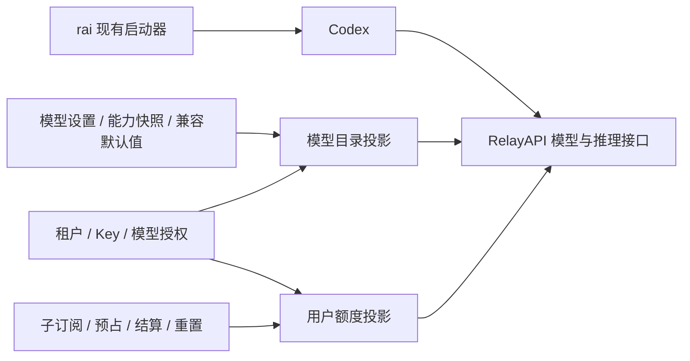

# rai 额度与 Codex 互操作设计

状态：核心功能已实施（2026-09-28），下文保留设计边界；已验证 Codex CLI 0.156.1 的 HTTP / WebSocket 额度状态读取，桌面端具体面板尚未验收。

本文替代此前的 rai 扩展架构设计。范围仅保留用户额度提供和 Codex 互操作，重点是模型元数据。取消通用管理 CLI、独立管理授权、管理 API、MCP 管理工具、插件框架及独立 TUI 的建设计划。

## 1. 目标与边界

用户继续通过 `rai codex` 使用 Codex。RelayAPI 提供准确的模型目录与用户配额，rai 负责现有登录、provider 配置和客户端启动，Codex 负责原生交互。

本设计只解决：

1. 向 Codex 提供用户实际获配的额度窗口，验证原生额度显示和更新。
2. 提供完整、准确、可追溯的模型元数据，使模型选择、推理档位、上下文与工具调用符合实际接入能力。
3. 保持目录刷新、模型别名、HTTP/SSE/WebSocket、配置和偏好同步的兼容性。

不改变现有账户管理方式、计费规则、配额分配规则或客户端启动命令。不引入新的管理身份；额度查询只允许当前 API Key 读取其授权范围内的数据。

## 2. 架构



保留两个职责清晰的投影：

- **模型目录投影**：把模型事实、RelayAPI 适配能力和用户可见性转换成 Codex 所需的目录格式。
- **用户额度投影**：从已有配额状态生成用户可见快照，再转换成经验证的 Codex 额度协议。

投影不修改业务状态、不另建账本。先以现有包中的函数和小型类型实现，不为这两个功能重构整个 rai 或增加通用框架。

## 3. 当前实现与落点

| 当前文件 | 已有能力 | 扩展方向 |
| --- | --- | --- |
| `internal/rai/codex.go` | 独立运行时 provider、command-based auth、参数和模型偏好传入 | 仅按实测需要调整兼容配置 |
| `internal/upstream/codex_catalog.go` | 补齐 Codex ModelInfo、默认能力和隐藏图像模型 | 区分默认补齐与明确覆盖，增加最终字段校验 |
| `internal/app/native_models.go` | 授权过滤、能力覆盖、别名、隐藏条目、传输策略和 ETag | 明确处理顺序与刷新契约 |
| `internal/store/model_settings.go` | 管理员模型元数据覆盖 | 复用现有设置，按需要补充字段级来源与缺省语义 |
| `internal/app/subscription_entitlements.go` | 子窗口总额、已结算、预占、剩余、重置时间 | 提取用户额度快照，复用现有计算 |
| `internal/app/public.go`、`native_websocket.go` | 用户鉴权、准入及请求生命周期 | 在有用户身份和实际路由结果的位置提供额度 |
| `internal/upstream/native_serve.go` | 上游响应头白名单 | 不直接放开上游配额透传，由外层生成用户配额 |

## 4. 更好的模型元数据

### 4.1 需要表达什么

| 类别 | 内容 | 用户体验 |
| --- | --- | --- |
| 身份与展示 | slug、显示名、简洁描述、排序、可见性 | 能辨认并选择正确模型 |
| 上下文 | 默认/最大上下文、输出上限，以及协议支持的上下文使用策略 | 减少超限及不合适的压缩行为 |
| 推理 | 支持的 effort、默认 effort、档位说明 | 选择器展示可用档位，实际请求与选择一致 |
| 输入 | 文本、图像及实际支持的图像细节 | 不向不支持的模型发送图片 |
| 工具 | apply_patch、并行调用、搜索、结构化工具转换 | Codex 工具与 RelayAPI 适配结果一致 |
| 传输 | HTTP/SSE、WebSocket 的有效支持情况 | 避免选择无法处理的传输路径 |
| 兼容 | 必填字段、枚举、客户端版本、目录 revision | 避免单个坏条目导致整个目录失效 |

字段名称和枚举以目标 Codex 版本的契约验证为准。当前代码已有的 ModelInfo 字段可以继续使用；新增字段不能仅凭名称猜测客户端支持。

### 4.2 模型事实与适配能力分开

模型上下文、模态和原生推理档位是模型事实；工具格式转换、传输支持是 RelayAPI 的适配能力；是否允许调用是租户与 Key 的授权策略。三者分别计算，最后生成面向用户的目录。

保留现有“尽量提供完整 Codex agent 能力、由 adapter 转换协议”的产品方向。每个对外声明的能力应有原生支持或已验证的转换路径；无法兑现的能力不能仅因模板默认值而宣传为支持。

当前 `applyModelsDevCapability` 会在关闭 WebSocket 时同时关闭 verbosity 并移除 multi-agent 字段。后续应将这些能力独立判定：传输方式本身不应决定推理或工具能力。已有 provider 限制通过明确的适配规则保留，不能在拆分时意外全部开启。

### 4.3 确定的构建顺序

1. 收集现有模型事实及有效能力快照。
2. 按字段应用管理员明确设置；保留明确的 `false`。沿用当前配置格式：零上限、空字符串、空列表表示继承；推理明确关闭用仅含 `none` 的列表，不新增配置迁移。
3. 对缺失的协议必填字段使用版本化兼容默认值，保留来源；不覆盖前两步已确认的值。
4. 应用 RelayAPI 当前运行时能力约束，生成真实可用能力。管理员设置不能开启服务器实际无法提供的传输。
5. 应用用户授权和别名，生成可见项及必要的完整隐藏条目。
6. 校验完整目录，计算用户范围内的 revision / ETag 并输出。

模型事实的覆盖优先级为：有效的管理员显式设置 > 现有规则选定的可信模型资料 > 兼容默认值。现有 OpenAI slug 不使用 models.dev 自动覆盖的规则保留，若需改变，按具体模型另行验证。元数据源只提供事实，不授予模型访问权限。

不要仅凭模型名称前缀判断实际目标能力。别名继承解析后的真实目标元数据；对外 slug 保持别名，授权仍检查最终目标。

### 4.4 校验与更新

- 上下文和输出上限必须有效；最大上下文不得小于默认上下文。新增字段之间的约束以协议与模型资料为准，不随意补出虚假的精确值。
- 默认推理档位必须属于支持列表。无推理模型按客户端支持的方式表达，不能机械套用通用四档。
- 明确关闭或不支持的能力不能被后续通用补齐重新开启。优先采用有缺省语义的类型化中间数据，在协议边缘序列化。
- `visibility=hide` 的条目也必须通过 ModelInfo 校验；继续保留现有 tombstone 行为，防止客户端内置目录重新显示被禁止模型。
- 图像生成专用模型继续从 Codex 对话选择器隐藏，保留现有图像 API 行为。
- ETag 应覆盖影响最终输出的模型设置、有效能力快照、别名、授权、运行策略和协议 revision；切换 Key 或租户不得误用旧目录。
- 外部资料获取失败时使用最后一次有效快照，避免每次启动在线查询。身份相关可见性必须按当前权限重新计算，不能复用旧授权。
- 新快照或设置在发布前校验；失败不覆盖有效元数据。若当前授权变化，不能回退成包含旧权限的完整目录。
- 对目标 Codex 版本验证 `X-Models-Etag` 等已有刷新机制；上下文、档位或别名改变后，客户端应取得新数据，而不仅仅是服务器返回新 ETag。

## 5. 用户额度提供

### 5.1 额度快照

建议内部快照包含：用户可见的订阅/bucket 标识、模型适用范围、窗口种类和长度、总额、已结算额、预占额、剩余额、真实重置时间及快照时间。只提供显示所需内容，不返回上游账号、凭据 ID 或其他租户信息。

沿用现有整数金额单位与结算状态：

```text
used = settled + reserved
remaining = max(0, limit - used)
used_percent = clamp(100 × used / limit, 0, 100)  // 仅用于有限且正额度
```

保留原始整数计算结果，只在协议输出时转换百分比。零额度、无限额度和未知额度分别表达；未知不能显示为“剩余 100%”。额度投影与实际准入共用规则，不另造一套消耗计算。

### 5.2 与 Codex 窗口对应

- 真实 `7d` 配额可以投影成 10080 分钟的周窗口；真实 `5h` 对应 300 分钟。重置时间来自已有子订阅窗口。
- 普通账户余额没有周周期，不伪装成每周额度，也不生成虚假的重置时间。
- 查询当前租户全部有效子订阅，并用 Key 权限、子订阅与父订阅模型限制以及运行时实际模型过滤。不为展示创建预占；从父窗口按子订阅分配比例投影尚未使用的窗口。
- 内部保留全部子订阅与窗口的独立投影。当前 Codex 适配器只选择本次准入实际使用的子订阅，用固定 `codex` 组整体替换旧状态；最多发送两个有效窗口，按周期从短到长选择，超出部分留在内部。窗口支持明确的分钟、小时、天、周时长及 daily/weekly；monthly/余额因没有明确固定时长而省略。
- 显示用户获配的子额度，不直接使用 `UpstreamUsedPercent` 或上游响应中的账号总额度。
- 周额度百分比只表示对应配额窗口；余额、Key 限制或上游容量可能独立阻止调用，由现有准入逻辑与错误说明处理。

### 5.3 协议与读取边界

Codex 官方文档中的窗口包含 `usedPercent`、`windowDurationMins`、`resetsAt`，但 `account/rateLimits/read` 与 `account/rateLimits/updated` 面向 ChatGPT 账号。它们是 app-server 读接口和通知，不是第三方 provider 的通用额度写接口。详见[已查阅的官方额度文档](https://learn.chatgpt.com/docs/app-server#6-rate-limits-chatgpt)。

真实 Codex 0.156.1 的隔离测试确认 HTTP 使用 `x-{bucket-id}-primary/secondary-used-percent`、`window-minutes`、`reset-at` 响应头；WebSocket 使用 `codex.rate_limits`，其中 `metered_limit_name` 为 bucket ID，窗口字段为 `used_percent`、`window_minutes`、`reset_at`。SSE 不消费这一 WebSocket 事件，因此不向 SSE 插入此消息。

**实测兼容边界：** 当前客户端推理通路将多组更新合并，`account/rateLimits/updated` 只通知最后一组。因此当前输出已收敛为准入选定子订阅的单个固定 `codex` 组，最多两个窗口；不启用多订阅同时输出，也不依赖事件顺序选择订阅。完整多组展示需要客户端保留并通知全部组。WebSocket 解析器会丢弃 `limit_name`；HTTP 显示名称仅发送安全 ASCII，其他名称回退为服务标识。

CLI `/status`、状态栏和桌面端分别验收；客户端状态能解析不代表所有 UI 都已逐一验收。Codex CLI 0.158.0 隔离测试仍能解析 HTTP / WebSocket 额度并发出 app-server 更新，但当前 CLI `/status` 对自定义 provider 显示 `data not available yet`；见 [Codex 回归问题 #45052](https://github.com/openai/codex/issues/45052)。RAI 提供 `rai quota`，通过当前 API Key 的只读 `/api/rai/quota` 查看本人可用额度。

额度数据由具有用户身份的 RelayAPI 网关层生成。若验证确实需要额外的只读查询端点，使用现有模型 Key 鉴权并限定到该 Key 的可见范围；不增加管理 API 或管理凭据。

HTTP 响应头提供发送时快照；结算后的新数据只通过已验证的 SSE/WebSocket 更新机制提供。长连接要考虑多轮请求，不能仅在握手时发送一次。未识别的事件不得试探性加入生产响应流。

额度展示失败不应改变请求计费、准入或原有模型调用结果。展示读取应有超时与成本边界，不为每个流片段查询数据库；更新时机围绕准入和终态结算。

## 6. rai 与 Codex 的兼容边界

- 继续使用现有运行时 provider 和 `credential print`，保持模型 Key 的用途。
- 保持 `--` 后参数透传、子进程 I/O、退出码、CODEX_HOME、模型与推理偏好同步、configure 备份及更新恢复行为。
- 服务端拥有模型和额度数据，rai 不保存另一份事实源，也不修改 Codex 本地会话数据库或伪造 ChatGPT 登录。
- 启动适配、目录投影、额度投影分别测试。新元数据或额度改动不应要求重写现有 `App` 命令分发。
- 按经过验证的客户端版本维护兼容 fixture。未知版本采用仍有效的基础契约，扩展字段与额度显示按兼容证据启用；不要只比较二进制版本字符串就假定能力存在。
- 若原生额度 UI 必须修改 Codex 才能接入，记录限制并另行决策；本设计不包含维护 Codex 分支或替代界面的工作。

## 7. 实施顺序与验收

| 步骤 | 交付 | 验收 |
| --- | --- | --- |
| 1. 固定兼容基线 | 现有目录、别名、模型选择、偏好和启动行为 fixture | 明确当前支持范围及不可回归行为 |
| 2. 原生额度验证 | 隔离 Codex 配置、本地 mock、假 Key、已知额度窗口 | 确认自定义 provider 的输入通路、刷新和实际 UI；分别记录 CLI 与桌面端结果 |
| 3. 元数据改进 | 字段覆盖顺序、独立能力判断、目录校验和 revision | 管理员显式值不被补齐覆盖；模型选择与实际请求一致；客户端取得更新 |
| 4. 用户额度接入 | 从真实子窗口生成快照，接入步骤 2 验证通过的协议 | 预占、结算、耗尽、重置、多 Key、多订阅和长连接展示正确；无跨租户泄露 |
| 5. 联合回归 | 目标 Codex 版本与旧服务端/旧 rai 组合 | 新功能缺失不破坏已有启动、推理、模型目录和偏好 |

步骤 3 不依赖额度 UI 验证成功，可以独立交付。步骤 4 以原生通路验证通过为前提，不以猜测的响应头或伪造账号状态实现。

测试沿用已有 `internal/rai`、`internal/upstream/codex_catalog_test.go`、`internal/app/native_models_test.go` 和订阅测试。新增测试围绕真实边界：明确的 false/空值、无推理模型、别名目标变化、权限变化、坏快照、缓存刷新和窗口重置。协议层增加真实 Codex 客户端验证，不能只断言 JSON 中存在字段。

## 8. 当前交付与验证方式

已实施：按字段合并元数据、保留显式能力、推理档位规范化和保存校验、独立传输偏好、内容 revision、读取失败保留快照；租户与 Key 权限范围内的多子订阅配额查询、HTTP 响应头、WebSocket 初始/终态更新及上游额度过滤。另提供按当前 Key 授权范围查询的只读 `rai quota`；没有新增管理接口或授权体系。

额度查询按已鉴权租户、Key 模型权限及有效订阅过滤，以四次批量读取避免 N+1 查询；按父窗口代次投影分配额，只有同一代次才复用子窗口计数。Codex 输出再按 admission 的子订阅 ID 精确选择，最多发送两个有效窗口，不限于 5h/7d。读取超时上限为 250ms；无已选订阅、没有有效窗口或读取失败均输出空状态，避免保留另一个订阅的额度。HTTP 是准入后、响应前的快照，结算结果在后续请求反映；WebSocket 在每轮用量持久化后更新。两个槽位整体替换，缺失窗口为 null。非 Codex WebSocket 客户端不增加新事件。

常规测试：`go test ./...`。真实客户端契约测试设置 `CODEX_INTEROP_BINARY` 为 Codex 原生可执行文件的绝对路径，再运行 `go test ./internal/app -run '^TestCodexClientReadsRelayQuota$' -count=1 -v`。该测试使用隔离 CODEX_HOME、本地 mock 和假 Key，通过 app-server 验证两种传输下已选订阅的两个窗口、切换后只有一个窗口以及空额度状态；同时沿用 rai 的 command-based auth，确认 Codex 获取完整目录，并实际采用自定义模型的上下文窗口。数据库隔离与重置测试为 `TestSubscriptionQuotasAreBoundToTenantModelsAndGeneration`，需要专用 `TEST_DATABASE_URL`；未配置时跳过。

后续客户端版本须重跑上述协议测试。桌面端面板、首次请求前显示及真实部署下的完整用户流程仍是单独的验收项，不能用 mock 协议测试替代。
